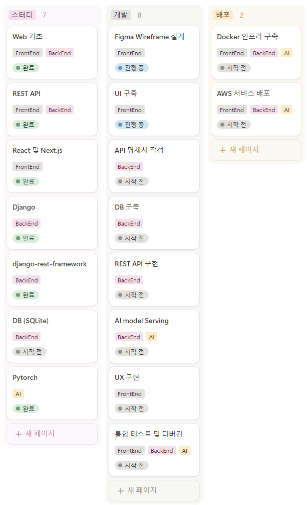

[](https://classroom.github.com/a/T3QcP9pQ)


## README.md 가이드라인
- README 파일 작성시에 아래의 5가지 항목의 내용은 필수적으로 포함해야 합니다.
- 아래의 7가지 항목이외에 프로젝트의 이해를 돕기위한 내용을 추가해도 됩니다.
- `SAMPLE_README.md`가 단순한 형태의 예제이니 참고하세요.
### 1. 프로젝트 소개
#### 1.1. 개발배경 및 필요성
AID(정보컴퓨터공학부 AI동아리) 내에서 `맥도날드 리뷰 데이터 별점 예측` 대회를 개최하였습니다. 맥도날드 매장에 대한 리뷰(영문) 데이터를 통해 학습된 모델이 리뷰 텍스트를 입력받으면 해당 리뷰의 별점은 몇점인지 예측하는 모델이 개발되었고, 개발된 모델을 시연해볼 수 있도록 웹서비스로 배포하는 것이 목적입니다. 해당 모델이 대회에서만 1회용으로 제작되는 것에 그치는 것이 아닌 누구나 시연해 볼 수 있는 환경이 필요하여 시작된 토이 프로젝트입니다.

#### 1.2. 개발 목표 및 주요 내용
맥도날드 매장의 후기를 영어로 입력받으면 해당 후기를 남긴 유저의 별점을 예측하는 프로그램을 배포하는 일련의 과정을 스터디하고 경험하는 것을 목표로 하고 있습니다. 이번 토이 프로젝트를 통해 웹과 Pytorch 모델이 어떻게 결합될 수 있는지 스터디 해보고 차후에 AI 모델을 학습하고 python 환경에서 이용하는 것에서 벗어나 누구나 쉽게 모델을 이용해볼 수 있는 환경을 제작하는 능력을 갖추는 것이 목표입니다.

#### 1.3. 세부내용
- 프론트엔드: Next.JS를 활용한 프롬프트 시스템
- 백엔드: Django + Pytorch로 AI 모델 API화, Django <-DB-> SQLite
- AI: AI모델 튜닝 및 인스턴스화
  - AI 모델을 위해 메모리, CPU 등의 하드웨어 성능이 뒷받침 되어야 할 것으로 보임.
  - Pytorch 모델을 Django 앱과 비동기적으로 동작하도록 설계하는 것이 중요함.

#### 1.4. 주차 별 계획 및 진행사항

(2024-10-26 기준)
[](https://aeolian-arch-69e.notion.site/12b7102ef97780f287b4e18be2041cc1?v=3907530821de471d91c949cfe7f19a53)

- **F**: Front-End
- **B**: Back-End
- **A**: AI & Pytorch

| 주차 | 키워드 | 계획 | 진행 내역 |
|:-------:|:-------:|:-------:|:-------:|
| 1주차 | React | Web 기초 스터디 **F** <br> React 스터디 **F** | 1. [HTML, CSS, JS](./documents/week1/Web%20Basic.md) <br> 2. [React](https://www.notion.so/React-5d06778aa9b541d8ba95270fd4db5591) |
| 2주차 | HTTP, Figma | HTTP 기반 API 스터디 **F,B,A** <br> Figma로 Wireframe 설계 **F** | 1. [HTTP 기반 API](https://www.notion.so/HTTP-API-64249f434f934fb3a7da7c9062b9fad3) <br> 2. [Figma Wireframe](./documents/week2/Figma%20Wireframe.md) |
| 3주차 | Django, REST API | Django 기초 스터디 **B,A** <br> Django REST Framework 스터디 **B,A** | 1. [Django](./documents/week3/django/django%20basic.md) <br> 2-1. [Django ↔ React](./documents/week3/django-react%20연동/django-react%20연동.md)<br> 2-2. [django-rest-framework](./documents/week3/djangoRestFramework/djangoRESTframework.md) |
| 4주차 | Pytorch <br> Next.js <br> DB | Pytorch 기초 스터디 **A** <br> Next.js로 UI 구축 -1- **F** <br> DB (PostgreSQL) 스터디 **B** | 1. [Pytorch Basic](./documents/week4/Pytorch%20Basic.md) <br> 2. [Next.js UI](./documents/week4/NextJS_Create_the_UI.md) <br>  3. [Databse](./documents/week4/DataBase.md) |
| 5주차 | Pytorch <br> Next.js <br> Django, REST API | Pytorch 모델 가공 -1- **A** <br> Next.js로 UI 구축 -2- **F** <br> API 명세서 작성 및 DB ERD 작성 **B,A** | 1. [Pytorch 모델 가공](./documents/week5/Modularzation_ipynbToPy.md) <br> 2. [Next.js UI](./documents/week4/NextJS_Create_the_UI.md) <br> 3-0. [Django 환경 세팅](./documents/week5/Django_Install_and_Setting.md) <br> 3-1. [API 명세서 작성](./documents/week5/API_Document.md) |
| 6주차 | Pytorch <br> Next.js <br> Django, REST API | Pytorch 모델 가공 -2- **A** <br> Next.js로 UX 구축 -1- **F** <br> REST API 구현 -1- **B** | 1. [Pytorch 모델 가공](./documents/week5/Modularzation_ipynbToPy.md) <br> 2. Next.js UX <br> 3. [REST API 구현 -1-](./documents/week6/RESTAPI_구현-1-.md) |
| 7주차 | Pytorch <br> Next.js <br> Django, REST API | Pytorch 모델 API Serving **A** <br> Next.js로 UX 구축 -2- **F** <br> REST API 구현 -2- **B** | 1. [Torch 모델 API Serving](./ai-web-back/api/tasks.py) <br> 2. Next.js UX <br> 3. [REST API 구현 -2-](./documents/week7/RESTAPI_구현-2-.md) |
| **8주차** | Pytorch <br> Next.js <br> Django, REST API | 통합 테스트 및 디버깅 -1- **F,B,A** | - |
| 9주차 | Pytorch <br> Next.js <br> Django, REST API | 통합 테스트 및 디버깅 -2- **F,B,A** | - |
| 10주차 | Docker | Docker로 인프라 구축하기 **B** | 1. [Docker 설정하기](./documents/week10/docker.md) |
| 11주차 | AWS | 서비스 배포 **B** | - |

### 2. 상세설계
#### 2.1. 시스템 구성도


#### 2.1. 사용 기술

- Frontend
  ```text
    Node.js v20.18.0

    "dependencies": {
      "react": "19.0.0-rc-69d4b800-20241021",
      "react-dom": "19.0.0-rc-69d4b800-20241021",
      "next": "15.0.1"
    }
  ```
 
- Backend ([pip_requirements.txt](./ai-web-back/pip_requirements.txt))
  ```text
    Python 3.11.4

    celery==5.4.0
    Django==5.1
    django-cors-headers==4.6.0
    djangorestframework==3.15.2
    gevent==24.11.1
    lightning==2.4.0
    redis==5.2.0
    torch==2.5.1
    transformers==4.46.3
  ```

- Infra
  ```text
  Docker
  ```

### 3. 개발결과
#### 3.1. 전체시스템 흐름도


#### 3.2. 기능설명
서비스는 단 하나의 페이지로 이루어져 있습니다.
- 리뷰 입력하기
  - 사용자는, 리뷰 입력 후 본인이 직접 남길 별점(AI가 맞춰야하는 별점)을 입력합니다.
- AI 연산 기다리기
  - AI의 연산이 완료될 때 까지 기다립니다.
- AI가 예상한 별점 확인하기
  - 사용자가 입력한 리뷰텍스트를 바탕으로 AI가 예측한 `사용자가 남길 별점`을 로드하여 확인합니다.

#### 3.3. 기능명세서
- Front End WireFrame: [Figma Link](https://www.figma.com/design/W0H8nZWsKPx3kqhnuEPOg0/AI-Web-Study?node-id=0-1&t=919RrO8ZHoLmXY23-1)
- System Diagram: [Figma Link](https://www.figma.com/design/W0H8nZWsKPx3kqhnuEPOg0/AI-Web-Study?node-id=18-7&t=919RrO8ZHoLmXY23-1)
- API Docs: [Notion Link](https://aeolian-arch-69e.notion.site/1317102ef97780119d9ccd079265e578?v=f37d9ae956b942a2b17f77175503c141)
- ERD, 하나의 테이블로 이루어져 있어 이미지로 대체


#### 3.4. 디렉토리 구조
> 위 레포지토리의 디렉토리 구조를 설명하세요.

### 4. 설치 및 사용 방법
> 제품을 설치하기 위헤 필요한 소프트웨어 및 설치 방법을 작성하세요.
>
> 제품을 설치하고 난 후, 실행 할 수 있는 방법을 작성하세요.

### 5. 소개 및 시연 영상
> 프로젝트에 대한 소개와 시연 영상을 넣으세요.
> 프로젝트 소개 동영상을 교육원 메일(swedu@pusan.ac.kr)로 제출 이후 센터에서 부여받은 youtube URL주소를 넣으세요.

### 6. 팀 소개
> 팀원 소개 & 구성원 별 역할 분담 & 간단한 연락처를 작성하세요.
#### 🍱 배고픈사람들
| 이동훈 | 조현성 | 안소희 | 박준혁 | 박상훈 |곽도연 |
|:-------:|:-------:|:-------:|:-------:|:-------:|:-------:|
| |  |  | | |  |
| therqq13@pusan.ac.kr | sungsam3312@pusan.ac.kr | soheean1370@pusan.ac.kr | eppi001004@gmail.com | sanghoon556@pusan.ac.kr |gdy0210@pusan.ac.kr |
| 총괄 <br/> 인프라 구축 | Pytorch 개발 | Pytorch 개발 | 백엔드 개발 | 백엔드 개발 | 프론트엔드 개발 |
