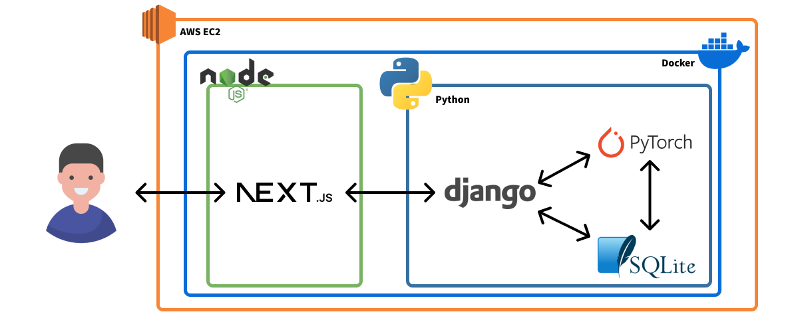

# Docker로 인프라 구축하기

Docker를 이용하면 프론트엔드와 백엔드의 복잡한 실행과정을 명령어 하나로 줄일 수 있고, 개발자 각각의 개인 환경 및 배포 환경에 구애 받지 않고 쉽게 실행할 수 있다.

## 시스템 구상도


## Compose.yaml
**[compose.yaml 바로가기](../../compose.yaml)**

`Docker-Compose`는 도커의 여러 이미지 및 컨테이너들을 하나로 묶을 수 있는 기능이다. 프로젝트에 필요한 컨테이너는 총 다섯개이다.

### 1. DB 컨테이너
```yaml
  db:
    # postgres 공식 이미지를 이용하면 별도의 `dockerfile`이 필요하지 않으므로 `postgres:15`를 이용한다.
    image: postgres:15
    container_name: postgres
    # 컨테이너 실행에 실패할경우 바로 재실행한다.
    restart: always
    # PostgrSQL의 기본 포트를 개방한다.
    ports: 
      - "5432:5432"
    # PostgreSQL 기본 환경에 필요한 환경변수를 불러온다.
    environment:
      POSTGRES_USER: ${DATABASES_USER}
      POSTGRES_PASSWORD: ${DATABASES_PASSWORD}
      POSTGRES_DB: ${DATABASES_NAME}
      POSTGRES_HOST_AUTH_METHOD: trust
    # 컨테이너 재실행시 데이터를 유지하기 위해 필요하다.
    volumes:
      - ~/apps/postgres:/var/lib/postgresql/data
    # 백엔드(Django)에서 접속하기 위해 같은 networks로 묶는다.
    networks:
      - aiweb-network
```
- DB 컨테이너는 PostgreSQL을 담은 컨테이너이며, 백엔드에 필요한 데이터베이스를 관장하고있다.

### 2. Front-end 컨테이너
```yaml
  front:
    container_name: frontend-nextjs
    # ./ai_web_front 폴더를 기반으로 ./ai_web_front/dockerfile 이미지를 이용해 컨테이너를 실행한다.
    build:
      context: ./ai_web_front
      dockerfile: ./dockerfile
    # 컨테이너 실행에 실패할경우 바로 재실행한다.
    restart: always
    # Next.js의 기본 포트를 개방한다. (실제 배포 환경은 수정이 필요하다.)
    ports:
      - "3000:3000"
    # Node.js 환경에 필요한 module을 빠르게 로드하기 위해 volumes을 이용한다. Next.js의 빠른 re-load에 도움을 준다.
    volumes:
      - ./ai_web_front:/usr/src/frontend
      - /usr/src/frontend/node_modules
      - /usr/src/frontend/.next
    # 백엔드(Django)와 API통신을 하기 위해 같은 networks로 묶는다
    networks:
      - aiweb-network
    # Docker 환경에서 Next.js의 Re-load 기능을 이용하기 위한 세팅이다.
    environment:
      - NODE_ENV=development
      - CHOKIDAR_USEPOLLING=true
      - WATCHPACK_POLLING=true
    # .env 파일을 불러와 환경변수를 로드한다.
    env_file: ./.env
```
- front 컨테이너는 Next.js를 이용한 프론트엔드 환경을 실행한다.

### 3. redis 컨테이너
```yaml
  redis:
    # redis 공식 이미지를 이용하면 별도의 `dockerfile`이 필요하지 않으므로 `redis:7`을 이용한다.
    image: redis:7
    container_name: redis
    # 컨테이너 실행에 실패할경우 바로 재실행한다.
    restart: always
    # Redis의 기본 포트를 개방한다.
    ports:
     - "6379:6379"
    # 보안을 위해 Redis에 비밀번호를 설정해준다.
    command: ["redis-server", "--requirepass", "${REDIS_PASSWORD}"]
    # 재실행시 데이터 유지를 위해 volumes를 설정한다.
    volumes:
      - ./redis/data:/data
    # 보안을 위해 Redis에 비밀번호를 설정해준다.
    environment:
      REDIS_HOST_PASSWORD: ${REDIS_PASSWORD}
    # Celery에서의 접속을 위해 같은 networks로 묶는다
    networks:
      - aiweb-network
```
- redis는 비동기 병렬처리를 위한 Celery의 Brocker로 이용된다.

### 4. celery 컨테이너
```yaml
  celery:
    container_name: celery-worker
    # ./ai-web-back 폴더를 기반으로 ./ai-web-back/dockerfile 이미지를 이용해 컨테이너를 실행한다.
    # ./ai-web-back/dockerfile은 Back-end 컨테이너와 같은 Python 환경이므로 Back-end 컨테이너와 같은 dockerfile을 이용한다.
    build:
      context: ./ai-web-back
      dockerfile: ./dockerfile
    # 컨테이너 실행에 실패할경우 바로 재실행한다.
    restart: always
    # Django와의 통신을 위해 같은 networks로 묶는다
    networks:
      - aiweb-network
    # 구동을 위해 필요한 환경변수를 로드한다.
    env_file: ./.env
    # dockerfile을 통해 컨테이너 실행후 마지막에 Celery worker를 실행하는 명령어를 실행한다.
    command: celery -A myapp worker -l info --pool threads
    # redis 컨테이너 구동 후 실행할 수 있도록 설정한다.
    depends_on:
      - redis
```
- AI 모델을 비동기 병렬처리하기 위해 Celery를 이용한다.

### 5. backend-django 컨테이너
```yaml
  back:
    container_name: backend-django
    # ./ai-web-back 폴더를 기반으로 ./ai-web-back/dockerfile 이미지를 이용해 컨테이너를 실행한다.
    # ./ai-web-back/dockerfile은 Celery 컨테이너와 같은 Python 환경이므로 Celery 컨테이너와 같은 dockerfile을 이용한다.
    build:
      context: ./ai-web-back
      dockerfile: ./dockerfile
    # 컨테이너 실행에 실패할경우 바로 재실행한다.
    restart: always
    # Django를 위해 포트를 개방한다.
    # Django의 기본포트는 8000이나, 개발환경과의 포트 충돌을 피하기위해 8080으로 설정하였다.
    ports:
      - "8080:8080"
    # Next.js와의 API 통신 및 PostgreSql 접속을 위해 같은 networks로 묶는다
    networks:
      - aiweb-network
    # 구동에 필요한 환경변수를 로드한다.
    env_file: ./.env
    # 데이터베이스 마이그레이션 및 Django 서버를 실행한다.
    command: sh -c "python3 manage.py migrate && python3 manage.py runserver 0.0.0.0:8080 --noreload"
    # celery와 db 컨테이너 구동 후 실행할 수 있도록 설정한다.
    depends_on:
      - celery
      - db
```
- API서버를 담당하는 Django 컨테이너이다.