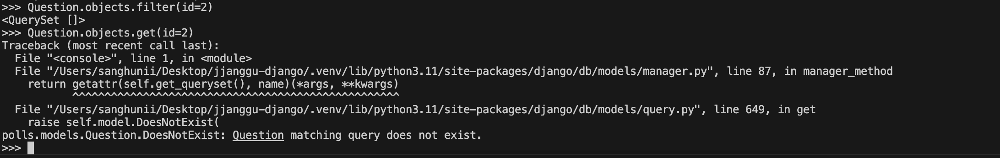

# Django model API & ForeignKey

<aside>
💡

본 페이지의 예제는 django tutorial step2 API 부분이며, 처음 공부하는 입장이라면 1번부터 차근차근 따라가면서 django에서 제공하는 model API에 대해서 알아가보길 바란다. 

</aside>

# 1. DB에 DATA저장하기

<aside>
💡

현재 models.py에 정의한 Question과 Choice model

 << Question model >>


<< Choice model >> 


ForeignKey(외래키)에 대한 설명 아래 Appendix에 적어놨다. 참고하자. 

</aside>

```python
##1. python shell을 열고 app/models.py에 정의해놓은 model들 import
python manage.py shell 
from polls.models import Question, Choice
#이때 왜 python shell이 아닌 manage.py를 이용해서 shell을 여는가? 
#=> We’re using this instead of simply typing “python”, 
#because manage.py sets the DJANGO_SETTINGS_MODULE environment variable, 
#which gives Django the Python import path to your mysite/settings.py file.

Question.objects.all()
#Question table의 모든 값들을 불러온다.
#Model.object클래스 정확히 무엇인지는 잘 모르겠으나 Django DB table을 다룰때 항상
#정의한모델.objects.메서드() 이런식으로 다룸. 

##2. 새로운 Question을 만들어서 DB에 저장해보자
#timewzone.now()사용을 위해 import
from django.utils import timezone
#새로운 Question 생성  
q = Question(question_text="What's new?", pub_date=timezone.now())
#DB에 저장
q.save() 
#잘 저장 되었는지 확인 
#주의 !! => 꼭 q.save()이케 해줘야지 DB에 반영된다.
q.id #이때 id는 생성된 Question의 PrimaryKey(pk).  q.pk도 동일한 값을 출력한다.

##3. DB에 존재하는 데이터에 접근해 보자. Question은 id(자동생성), question_text와 pub_date 이렇게 3개의 필드가 있다.
q.question_text
q.pub_date

##4. DB상의 Question값을 바꿔보자. 현재 id=1인 Question값을 q는 참조하고 있다. 
q.question_text = "What's up?"
q.save() #저장 
```

# 2. DB lookup API

<aside>
💡

현재 models.py에 정의한 Question과 Choice model

 << Question model >>


 << Choice model >>


</aside>

⇒ django는 풍부한 데이터 베이스 조회 API를 제공한다. 예제로 알아보자  

```python
##objects.filter()
Question.objects.filter(id=1) #Question.objects.filter(pk=1)과 동일
##id(혹은 pk)값을 가지고 있는 Question객체를 QuerySet형식으로 반환한다.

Question.objects.filter(question_text__startswith="What")
##question_text 필드의 값이 "What"으로 시작하는 Question을 QuerySet형식으로 반환한다.

from django.utils import timezone
current_year = timezone.now().year  #current_year의 현재 시점의 년도를 집어넣는다. 
Question.objects.get(pub_date__year=current_year) 
##DB상의 Question table에서 pub_date의 year값이 current_year과 동일한 데이터를 가져온다.
##이때 filter()가 아닌 get()을 사용했다. 
##filter()는 찾은 데이터를 QuerySet형식으로 반환하는 반면에 get()은 객체형태로 반환한다. 직접 확인해 보자
Question.objects.filter(pub_date__year=current_year)

##get()과 filter()는 DB상에서 값을 가져오는 방법이 잘못됐을때 return하는 값 또한 다르다. 
##get()메서드는 찾으려는 값이 DB상에 존재하지 않으면 DoesNotExist예외를 발생시킨다. 
##filter()는 동일한 상황에서 그냥 빈 쿼리셋을 반환한다. 아래의 코드로 직접 둘의 차이를 확인해 보자
Question.objects.filter(id=2)
Question.objects.get(id=2)
##termianl결과값 밑에 사진으로 첨부해 놓겠다 확인해보자

##Choice model은 Question에 대해 fk를 가지고 있다. (특정 Question의 id를 가지고 있다.)
##즉, Choice는 ForeignKey 필드를 확인 함으로써 어떤 question에 대한 choice인지 판단할 수 있다.
##이제 특정 Question에 대한 Choice를 생성해보자.
#1. 원하는 Question을 가져오자
q = Question.objects.get(pk=1)
#2. 현재 pk=1의 Question에 연관된 choice가 있는지 확인
q.choice_set.all()
#3. 3개의 create() method를 이용해서 3개의 choice를 만들어보자. 이때 인자값에 어떤 값들이 들어가야 하는지는 Choice model field를 확인.
q.choice_set.create(choice_text="Not much", votes=0)
q.choice_set.create(choice_text="The sky", votes=0)
c = q.choice_set.create(choice_text="Just hacking again", votes=0)
##각 출력값을 보면 알 수 있듯이. create()는 알맞은 Choice객체를 만들고 해당 객체를 리턴한다.
##또한 이때 Choice는 관련된 Question객체에 대한 API access 권한이 있다.

c.question  ##근데 이거 이해 안됨. question .. ? 어디서 나온거지 ... ? 

#4. 만들어진 choice_set들 확인, 갯수 확인
q.choice_set.all()
q.choice_set.count()

##공식홈페이지 설명## 
# The API automatically follows relationships as far as you need.
# Use double underscores to separate relationships. -> 예?
# This works as many levels deep as you want; there's no limit.
# 
# (reusing the 'current_year' variable we created above).
#5. 위에서 만들어놓은 curret_year변수를 이용해서 조건에 맞는 Choice를 찾아보자 
Choice.objects.filter(question__pub_date__year=current_year)

#6. fk값 이용해서 특정 Question에 연관된 Choice들 가져오기
Choice.objects.filter(question_id=1) 

#7. delete()이용해서 삭제하고자 하는거 삭제하기.
c = q.choice_set.filter(choice_text__startswith="Just hacking")
c.delete()
##삭제 잘 됐는지 확인 
q.choice_set.all()

```

<aside>
💡

filter() VS get() 없는 값 조회할때 반환값



추가로 objects.get()은 여러개의 값이 조회되면 MultipleObjectsReturned 예외를 발생시킨다. 

</aside>

# ForeignKey, CASCADE option

***<< ForeignKey >>***

- Choice model은 model.ForeignKey()라는 필드를 가지고 있다.
- Foreignkey란?
    - DB상의 어떤 테이블을 다른 테이블과 연결시킬 때 사용 한다.
    - 어떤 테이블은 연결하고자 하는 테이블에 대해 Foreignkey(외래키)를 가지게 되는데 이는 연결하고자 하는 테이블의 Primarykey(기본키)이다.
- django - models.ForeignKey(to, **options)
    - Choice model의 필드를 살펴보자
    - `question = models.ForeignKey(Question,on_delete=models.CASCADE)`
        - `Question` ⇒  Question모델에 대한 ForignKey를 가지고 있다. 즉, 특정 Question의 pk(primary key)를 가지고 있다.
        - `on_delete=models.CASCADE`  ⇒ 관계형 데이터베이스에서는 참조무결성을 유지시켜 줘야한다.  즉, pk와 fk간의 관계가항상 유효하도록 관리해 줘야 한다. 이를 위해 널리 사용되는 것이 CASCADE option이다.
        - 위와같이 CASCADE option을 사용하면 A라는 테이블을 참조하고 있던 테이블 B가 있다고 했을때, A라는 테이블을 삭제하면 B라는 테이블 또한 종속적으로 삭제된다.
        - 더 알고 싶으면 아래 내용 참고하기

<aside>
💡

**참조무결성과 CASCADE option**

참조무결성이란?

- 데이터베이스 상의 모든 참조가 유효해야 함을 뜻한다.
- 즉, Primary Key(pk)와 Foreign Key(fk) 간의 관계가 항상 유효하도록 관리해야 한다. 따라서 pk를 참조하는 fk가 있다면 해당 pk는 수정과 삭제가 불가능 하다.
- CASCADE옵션은 DB의 값을 수정/삭제할때 그 값을 참조하고 있는 레코드 역시 종속적으로 수정/삭제가 가능하게끔 해준다.
    - 수정 - ON-UPDATE-CASCADE
        - pk값을 수정하면 해당 fk값을 가지고 있는 레코드에서도 종속적으로 수정 되게끔 한다.
    - 삭제 - ON-DELETE-CASCADE
        - pk값을 삭제하면 해당 pk값을 참조하는 fk값을 가진 레코드 또한 종속적으로 삭제한다.
            - 즉 A라는 테이블이 있고 B라는 table이 A라는 테이블을 참조(fk를 가지고 있음, fk의 값은 A라는 테이블이 pk로서 가지고 있음)할 때, A라는 테이블을 삭제하면 B라는 테이블 또한 종속적으로 같이 삭제된다.
    - ON DELETE SET NULL
        - 참조하고 있던 테이블이 사라지면 fk값을 NULL로 바꿈.
</aside>
