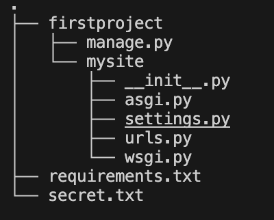
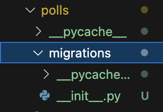
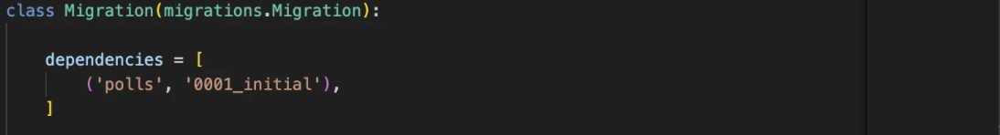
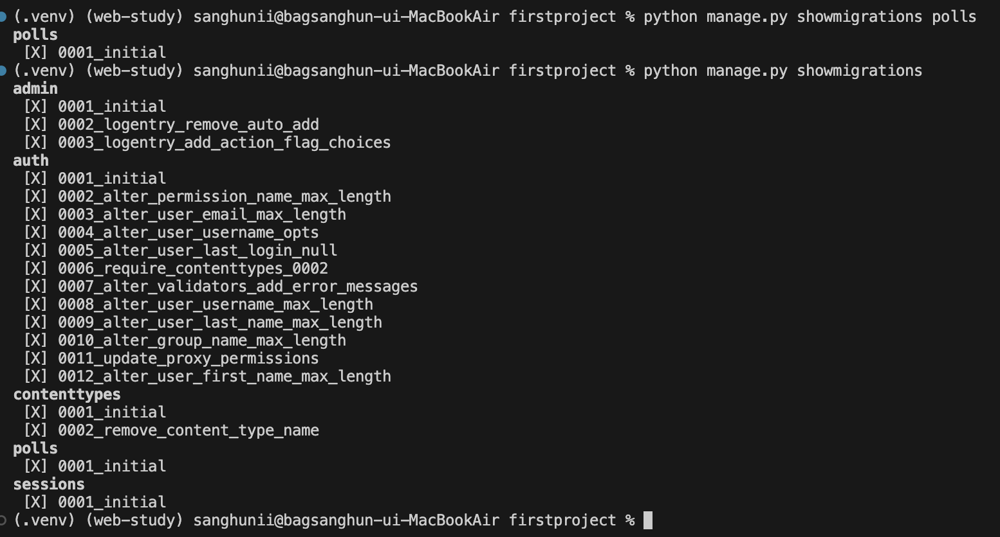
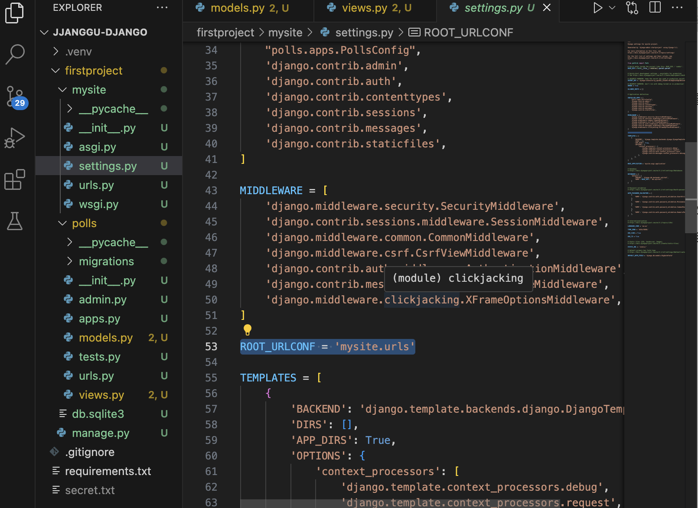
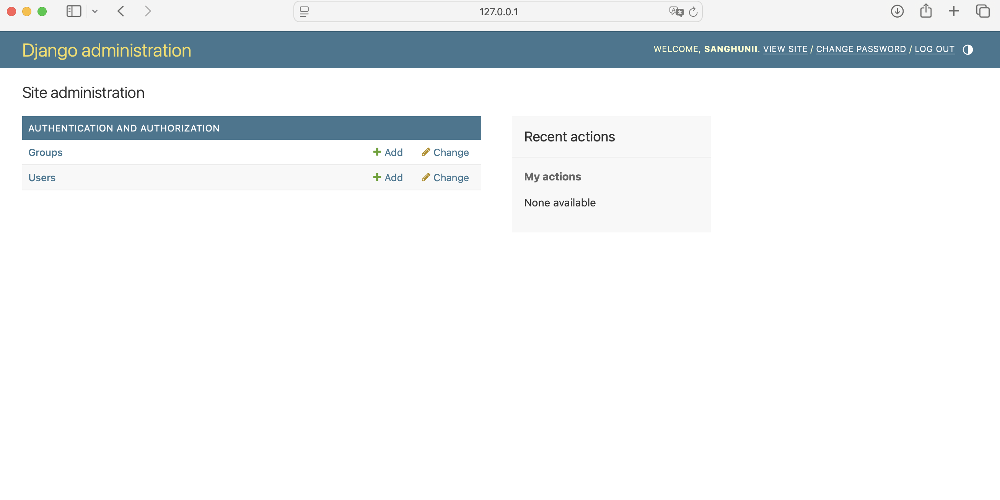
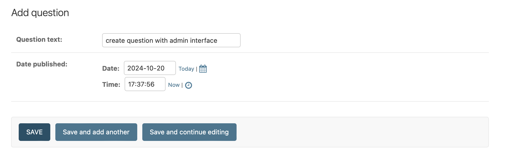

# django basic

> 
    django Tutorial을 따라하면서 모르는게 생겼을때 해당 페이지 찾아보고 하면서 공부하기.


# Django Project의 기본적인 디렉토리 구조

<<`django-admin startproject` 를 이용해서 처음 project를 생성했을때 생성되는 프로젝트 디렉토리의 구조>> 



- [manage.py](http://manage.py) ⇒ Django project와 여러 방면으로 상호작용 할 수 있도록 도와주는 커맨드라인 유틸리티. `python manage.py [뭐시기뭐시기]` 이런식으로 사용한다.
- mysite/ ⇒ 프로젝트를 위한 Python package들이 들어있는 프로젝트 디렉토리이다. 이 디렉토의 내부에 있는 파일들을 python package처럼 필요한 곳에 import해서 사용할 수. ㅣㅆ다.
    - mysite/__init__.py ⇒ 해당 파일이 속한 디렉토리가 python package처럼 다뤄지도록 해준다.
    - mysite/[asgi.py](http://asgi.py) ⇒ ASGI호환 웹 서버의 진입점
    - mysite/[wsgi.py](http://wsgi.py) ⇒ WSGI호환 웹 서버의 진입점
        - wsgi : Web Server Gateway Interface
        - asgi : Asynchronous Gateway Interface (wsgi의 비동기 요청에 대한 단점을 보완)
    - 둘 다 python application이 웹 서버와 통신하기 위한 통신 규약이다.
    - mysite/settings.py ⇒ Django project를 위한 전체적인 settings/configuration내용을 담고 있다.
    - mysite/urls.py ⇒ Django projcet에서 쓰이는 url들을 모아놓은 것. “Table of contents of Django-powered”
        - `include()` 를 이용해서 project에서 사용하는 app의 urls.py로 제어를 넘길 수 있다.


> 

    APP VS PROJECT

    ⇒ django app은 특정 기능을 수행하는 web application, django project는 웹사이트를 위한 app과 configuration, setting들을 모아놓은 것.

    ⇒ 하나의 project에는 여러개의 app이 들어갈 수 있다.

    ⇒ 예를 들면 naver는 project 블로그, 이메일 등은 naver project를 구성하는 app 

    ⇒ project에 app을 추가하고 싶으면 `python manage.py startapp [app-name]` 명령어를 이용해서 만들면 됨.

    


# Django의 기본구조 (MVT)

⇒ django 프레임워크는 MVT(Model - View - Template)패턴을 따른다. <br/><br/><br/><br/>


# MVT 패턴 


>
    1. 클라이언트로부터 요청을 받으면 URLconf를 이용하여 URL을 분석한다. 
    
        ⇒ 일단 처음 요청을 받으면 settings.py에 있는 ROOT_URLCONF로 이동해서urlpatterns에 매핑할 url을 찾는다. 
    
    2. 매핑할 url을 찾았으면 해당 요청을 처리할 view를 선택한다.
    3. 해당 view는 자신의 logic을 실행하면서 데이터 베이스 처리가 필요하면 Model을 이용해서 처리하고 그 결과를 반환 받는다. 
    4. view는 자신의 logic이 끝나면 template을 이용해서 클라이언트에게 전송할 html response를 생성. 
    5. 해당 response를 client에게 보내면서 응답. 


## Model 

### ORM

- ORM(Object Relational Mapping)이란 객체와 관계형 데이터베이스를 Mapping 시켜 주는 것을 말한다. 

`객체(Model) ↔ ORM ↔ DB`   이때 객체가 Model이다. 

- 로직을 구성하면서 CRUD를 위해 SQL을 작성할 필요없이 객체를 정의하고 ORM에서 제공하는 인터페이스(메서드)를 이용해 데이터베이스의 데이터에 쉽게 접근하는 방법을 제공한다. 

### [models.py](http://models.py)

- project의 각 app에는 [models.py](http://models.py)라는 파일이 있다. 해당 파일에서 사용할 테이블의 스키마를 클래스 형태로 정의한다.  

- `python manage.py startapp [app-name]` 을 이용해서 app을 생성하면 내부에 models.py라는 파일이 생성되는 것을 볼 수 있다. 해당 파일에 원하는 테이블의 스키마를 클래스형태로 정의해서 사용한다. 

- 정의만 한다고 DB에 바로 반영 되는 것이 아니다. migration을 통해서 [models.py](http://models.py)에서 정의한 것을 DB에 반영해 줘야한다. <br/><br/><br/><br/>


#### models.py에서 테이블 스키마 정의하고 migration을 통해서 DB에 반영하기 

1. [models.py](http://models.py)에 model 정의 (혹은 수정/삭제)


-  각 model은 django.db.models.Model을 상속받아야 한다.<br/><br/>

2. `python manage.py makemigrations [app-name]` 명령어를 통해서 migration파일 생성해주기




- polls.migrations에 0001_initial.py 파일이 생성된 것을 볼 수 있다.

- `python manage.py makemigrations [app-name]` 에서 특정 앱을 지칭해주지 않아도 되지만 그렇게 되면 의도치 않은 migration도 생성될 수 있어서 가급적이면 특정 app을 지칭해 주자. <br/><br/>

3. `python manage.py migrate [app-name` 이용해서 생성한 migration을 실제 DB에 반영해 준다.
    
    
    
<br/><br/><br/><br/>

## migration

 `migrations` 에 대해서 좀 더 알아보자 

### migrations이란
>
    - django에서 migrations이란 model의 변경사항을 DB에 전파하는 django의 방법이다. 

    - DB shcema를 git처럼 버전으로 나눠서 관리할 수 있게 해준다.

    - `makemigrations` 를 이용해서 새로운 버전의 schema를 생성할 수 있고 `migrate` 를 이용해서 새로 생성한 schama를 적용하거나 이전 버전으로 되돌릴 수 있다. 

### 주요 명령어


### 1. `python manage.py makemigrations [app-name]` 
    
   - django에게 내 model에 변경사항이 생겼다는 것을 알려준다.
    
    - model변경사항을 기반으로 migration파일을 생성 
    
    - 이때 [app-name]을 생략하면 전체 app에 대해서 실행된다. 다만 이렇게 할 시에 예상치 못한 migration이 생성될 수도 있어서 app-name을 지정해서 예상치 못한 migration생성을 방지하자.
    

### 2. `python manage.py migrate [app-name]` 
    
   - 생성한 migration을 실제 DB에 적용 혹은 적용한 migration을 DB에서 적용 해제 할때 사용한다. 
    
    


#### 1번 2번 추가 내용 (a, b)
<br/><br/>
#### 적용 
    
⇒ 위에 참고 <br/><br/>
    
#### 해제
    
`python manage.py manage.py [app-name] [적용하고자 하는 이전 버전 migration 번호]`  <br/>
    
 예시 <br/>
    

> 
    현재 0002번째 migration이 적용 되어 있는데 0001 버전으로 바꾸고 싶다. 
    
#### a. `python manage.py migrate polls 0001` 
        

        
        <br/><br/>
        
#### b. 0002번 migration파일을 삭제해 준다.
>    
    ‼️주의‼️
    
    각 migration은 이전 버전에 대해 의존성을 가지기 때문에 특정 migration파일은 절대 함부로 삭제 하면 안되고 삭제하고 싶다면 꼭 
    이전 버전의 migration을 적용한 다음 삭제해야 한다. 
    

<br/>    
- 위는 좀전에 삭제한 0002번 migration파일의 내용이다.
<br/>
>
    <b>0002번 migration파일을 삭제하고자 한다면 꼭 0001파일을 먼저 적용 한 후 삭제해야 한다.</b>
    
    
<br/><br/><br/><br/>

### 3. `python manage.py sqlmigrate [app-name] [migration-name]`

`[migration-name]` 에 해당하는 migration이 어떤 sql 구문으로 실행 되는지 보여준다.


<aside>

Example - Django Tutorial에서 만든 model가지고 실험

```python
BEGIN;
--
-- Create model Question
--
CREATE TABLE "polls_question" (
    "id" integer NOT NULL PRIMARY KEY AUTOINCREMENT, 
    "question_text" varchar(200) NOT NULL, 
    "pub_date" datetime NOT NULL
);
--
-- Create model Choice
--
CREATE TABLE "polls_choice" (
    "id" integer NOT NULL PRIMARY KEY AUTOINCREMENT, 
    "choice_text" varchar(200) NOT NULL, 
    "votes" integer NOT NULL, 
    "question_id" bigint NOT NULL REFERENCES "polls_question" ("id") DEFERRABLE INITIALLY DEFERRED
);

CREATE INDEX "polls_choice_question_id_c5b4b260" ON "polls_choice" ("question_id");
COMMIT;
```

-  terminal상의 output을 보기좋게 정리한 것. 

- `"polls_choice"`을 보면 4번째 요소에 `question_id`라는 요소가 있다. 이는 Choice model이 가지고 있는 foreignkey(fk)이다. 

- django의 관습(convention)에 따르면 fk필드의 이름에 _id를 붙여준다. 

즉, 해당 사실로 choice table은 question table에 대하여 fk를 가지고 있다는 것을 알 수 있다. <br/><br/>


### 4. `python manage.py showmigrations [app-name]` 

`[app-name]` 에 대한 migration 적용 여부를 한눈에 보여준다. 

`[app-name]` 을 생략하면 전체 project에 대한 migration 적용 여부를 한눈에 보여준다. 

 
<br/><br/><br/><br/>

## View & [urls.py](http://urls.py) <br/>

### view

- django에서 view는 웹페이지와 콘텐츠들을 전달한다. 각 view는 python function혹은 method(클래스 기반 view일때)로 표현된다.
- django는 요청된 url을 URLconf를 이용해서 분석하고 적절한 view를 선택해서 기능을 수행하고 template과 버무려 전달
- 각 view는 2가지중 하나를 수행한다.
    - 내용을 담아서 적절한 내용을 포함한 `HttpResponse`를 내보낸다.
    - `Http404` 와 같은 에러를 일으킨다. (rasing an exception)
    - 어찌됐건 django는 view로부터 HttpResponse나 exception을 응답받길 원한다.
- 또한 view는 DB상의 내용을 가져올 수 있다. (use Model interface)
- view는 template system또한 이용할 수 있다.
- view는 PDF, XML, ZIP파일등을 그때그때 생성 할 수 있고 어떤 python library든지 사용할 수 있다.

#### 1. [http://127.0.0.1:8000/polls/](http://127.0.0.1:8000/polls/) client가 해당 요청으르 보낸다.

#### 2. `ROOT_URLCONF` 에 해당하는 mysite/urls.py로 이동
    

    

#### 3. mysite/urls.py의 urlpatterns에서 요청과 일치하는 url패턴이 있는지 확인 
    

    

#### 4. `include()` 의 지시에 따라 polls/urls.py를 참조 
    

    

#### 5. 요청 url형식이 [`http://127.0.0.1:8000/polls/`](http://127.0.0.1:8000/polls/)  였으므로 path(’ ‘ )와 매칭되고 views.index를 불러온다.

#### 6. 요청에 맞는 적절한 로직을 수행 (views.index)하고  HttpResponse를 client에 전달.


<br/><br/><br/><br/>

#### path()와 include()

`path()`

- django.urls의 메서드
- `path()` 메서드는 2개의 parameter를 필수로 요구한다. `path(route, view)`
    - route : url패턴을 가진 문자열
    - view : HttpRequest 객체를 첫번째 인수로 하고, 경로로 부터 캡쳐된 값을 키워드 인수로 하여 특정한 view 함수를 호출
    - 이때 angle bracket을 사용해서 path(”<int: question_id>”) 이런식으로 만들면 django는 이부분을 캡쳐해서 키워드 인수로 보낸다.

`include()`

- django.urls의 메서드
- 다른 app의 URLconfs를 참조할 수 있게 한다. 즉, 다른 app의 urls.py의 urlpatterns를 참조할 수 있게한다.
- 위 예제에서는 include(’polls.urls’)이렇게 쓰였으므로 요청이 [`http://127.0.0.1:8000/polls/`](http://127.0.0.1:8000/polls/) 이런식으로 들어왔다면 polls app의 urls.py파일로 제어를 넘겨서 거기 있는 urlpatterns에서 일치하는 url패턴 찾기를 시도한다.
- django는 include()를 만나서 매칭이되면 url에 매칭이된 포인트까지는 짜르고 남은 부분을 전달한다.
  - Ex) url요청이 `http://127.0.0.1:8000/polls/abc` 였다면 `path('polls/', include(polls.urls)`)에 매칭된다. 이때 polls.urls에 url을 넘길때 polls까지 짜르고 /abc부분을 polls.urls로 보낸다.

<br/><br/><br/><br/>

### request

views.py에 정의된 함수를 보면 파라미터로 request라는 것을 받는다. 이게 무엇일까? 

>

    django에서는 response와 request객체를 이용해서 서버와 클라이언트가 상태를 주고 받는다. 이때 다음과 같은 과정을 거친다. 

    1. 특정 페이지가 request되면 django는 HttpRequest객체를 생성한다.
    2. django는 요청에 따른 적절한 views.py파일의 함수(혹은 클래스)에 첫번째 인자로 생성한 HttpRequest객체를 전달한다. 
    3. 해당 view는 결과를 HttpResponse나 JsonResponse에 담아서 template에 전달 

    위 예제의 views.index(request)함수에서 request가 받는 것이 페이지가 request 됐을때 django가 생성한 HttpRequeset객체이다.
<br/><br/><br/><br/>

### Generic View

⇒ django generic view란 djagno에서 기본적으로 제공하는 view클래스를 의미한다.

⇒ 활용 용도에 따라서 `Listview` , `DetailView` , `FormView` 등이 존재한다. <br/><br/><br/><br/>

##  Template

- Template을 이용해서 사용자가 보는 페이지를 디자인할 수 있다. (django의 front적인 요소)

- prjects의 settings.py에서 Template은 django가 어떻게 template을 loading하고 rendering할지 서술한다.
    
    
    
- 위 code는 Django Project를 생성했을때의 default로 생기는 TAMPLATE이다.

`BACKEND` : 사용할 django 템플릿 엔진을 지정한다. 위 코드에서는 django 기본 템플릿 엔진을 사용한다.  

`DIRS` : 순서대로 템플릿 엔진이 템플릿 소스를 찾아봐야 하는 디렉토리 목록

`APP_DIRS` : 템플릿 엔진이 INSTALLED_APP에 있는 app들 안에서 템플릿 소스 파일을 찾아야 하는지 여부이다.

`OPTIONS`  : 템플릿 백엔드(템플릿 엔진)에 전달할 추가적인 옵션이다. 

⇒ 위 설정들에 따라서 DjangoTemplates은 각 app들의 하위 디렉토리에서 “templates”파일들을 찾을 것이다. <br/><br/>

### template만들어보기
>
    - 기본 옵션은 위에 TEMPLATES에 설정 되어있는 그대로 사용

    - django tutorial2까지 진행했을때의 완성된 django프로젝트를 이용한다. 

    - polls.views에 있는 index에 대한 template을 만들어보자.

### 1. polls app내부에 templates 폴더 생성 
<br/>

### 2. 생성한 templates폴더 내부에 polls(앱이름과 동일한)폴더를 만들고 그 안에 index.html파일을 생성

⇒ 이까지의 디렉토리 구조는 `polls/templates/polls/index` 이렇게 된다.

이때 templates폴더 안에 현재 app의 이름을 딴 폴더를 하나 더 만들어 줬는데 polls/templates에 바로 템플릿을 넣을 수 있지만 이렇게 한 이유가 뭘까? 

⇒ django는 이름이 일치하는 첫번째 template을 선택하며 서로다른 app에 동일한 이름의 template이 있는 경우 django는 이를 구별하지 못한다. 그래서 서로다른 app의 template의 이름충돌을 피하고자 template에 현재 app의 이름을딴 하위 폴더를 하나 만들어주고 거기에 template을 넣어준다. <br/>

### 3. template작성

```python

    <ul>
    
        <li><a href="/polls/{{ question.id }}/">{{ question.question_text }}</a></li>
    
    </ul>

    <p>No polls are available.</p>

```
<br/>

### 4. template을 적용하고자 하는 view에 template적용

```python
from .models import Question
from django.http import HttpResponse
from django.template import loader

def index(request):
    latest_question_list = Question.objects.order_by("-pub_date")[:5]

    template = loader.get_template("polls/index.html")
    context = {
        "latest_question_list": latest_question_list
    }

    return HttpResponse(template.render(context, request))
```

- `template = loader.get_template("polls/index.html")`
    
    ⇒ polls/index.html을 로드해서 template에 담는다.
    
- `context = {"latest_question_list": latest_question_list)`
    
    ⇒ template에 전달할 내용을 만든다.
    
- `return HttpResponse(template.render(context, request))`
    
    ⇒ context를 template에 전달하고 template은 이를 랜더링하고 이 결과를 HttpResponse결과로 반환한다.
    
- 이때 `request` 는 `HttpRequest` 객체다. 안에는 현재 요청된 url, 세션 정보, 사용자가 로그인 했는지 여부 등 여러가지 정보들이 담겨있다. template에 request를 전달해줘야지 사용할 수 있다. 하지만 위 예제에서는 없어도 상관없다.

  <br/>

### 4-1. view에 template을 적용하는 조금 더 간단한 방법

```python
from django.shortcuts import render
from .models import Question

def index(request):
    latest_question_list = Question.objects.order_by("-pub_date")[:5]
    context = {"latest_question_list": latest_question_list}
    return render(request, "polls/index.html", context)
```

- `django.shortcuts.render()`를 사용
- 따로 template을 로딩하는 코드를 짤 필요가 없다.
    - `django.template.loader` 와 `django.http.HttpResponse` 가 필요없다.
- `render()`
    - 첫번째 인자로 request를 가진다.
    - 두번째 인자로 사용하고자 하는 template을 가진다.
    - 세번째로 추가적인 option을 dictionary형태로 가진다.<br/><br/><br/><br/>

# Django Admin

- Django는 사용자가 쉽게 콘텐츠를 생성, 수정, 삭제할 수 있는 관리자(admin)사이트 인터페이스를 제공한다. 

- 공식 홈페이지에 나와있는 tutorial을 따라가 보자

## #1. admin사이트에 접속할 user생성

`python manage.py createsuperuser`


## #2. 서버 키고 /admin/ 접속 해보기

- `127.0.0.1:8000/admin/` 해당 url로 접속 하면 아래의 화면이 나온다.


- 여기서 본인이 아까 작성한 Username과 pw를 기입하고 로그인하면 아래의 화면이 나온다.



- 처음 설명을 보면 해당 사이트는 콘텐츠를 쉽게 생성/수정/삭제 하기 위한 인터페이스라고 하였으나 Question과 Contents가 보이지 않는다. ⇒ app내부의 [admin.py](http://admin.py) 파일에 모델(models.py에 정의해 둔 것)을 등록해줘야 정상적으로 콘텐츠가 보인다. 

```python
from django.contrib import admin

from .models import Question, Choice

admin.site.register(Question)
admin.site.register(Choice)
```

- 이렇게 등록을 완료해주면 아래 페이지 처럼 Quesiton과 Choice가 생성된 것을 확인할 수 있다.


- 이제 admin사이트를 통해서 Question과 Choice를 생성해보고 제대로 생성 되었는지 확인해 보자.



- 여기서 save 버튼을 누르면


- 이렇게 잘 생성된 것을 확인해볼 수 있고 아래에 보이듯이 django에서 제공 model API를 이용해서 확인해도 보듯이 잘 생성된 것을 볼 수 있다. 


> 
    admin page에 대한 추가 내용

    1. 각 fireld유형에 따라 django는 적절하게(자동으로) client에게 display해서 보여준다
    2. 새로운 content를 create할때 now버튼을 눌렀는데 현재 시간이 적절하게 생성되지 않는다면 settings.py의 TIME_ZONE세팅이 되지 않았을 것이다. 적절하게 설정하고 다시 확인해보자.

