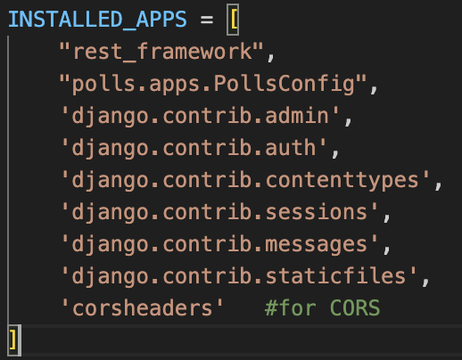
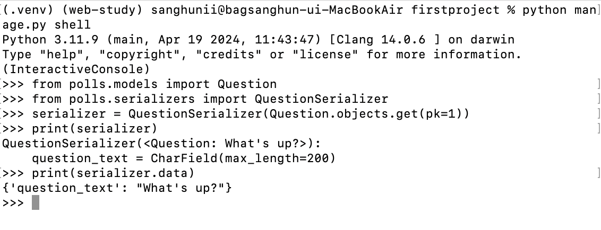
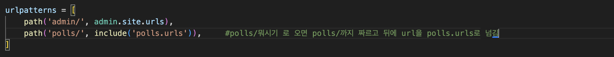

# django REST framework

# django REST framework란

- django web framework를 기반으로 한 패키지
- 이를 이용해 웹 개발자들은 JOSN 또는 XML과 같은 형식으로 쉽게 웹 API를 구축할 수 있다.
- REST
    - 2-2. django-react연동에서 REST에 대해 설명해놨다.
- RESTful
    - RESTful이란 REST의 원리를 따른 시스템을 일컫는다.
    - 단순히 REST의 원리를 따르기만 했다고 해서 RESTful이라고 할 수 없다. REST API의 설계 규칙을 잘 지킨 API를 RESTful하다 말할 수 있다.
    - 예를들어 **모든CRUD**를 **POST로** 처리한 API나, URI규칙을 올바르게 지키지 못한 API는 RESTful하다 말하지 못한다.

<aside>
😀

Django VS DRF

**django** 

→ 웹 애플리케이션 전반적인 개발을 위한 프레임워크

**DRF**

→ Django기반의 애플리케이션에서 RESTful API를 쉽게 개발하고 관리할 수 있도록 하는 도구

→ 다른 시스템, 애플리케이션, 서비스 등과 통신할 수 있는 API가 필요하다면 DRF를 이용.

</aside>

# DRF 예제1 - GET

- DRF를 이용해 API구현하기 예제

> **사용할 django 프로젝트/앱** : django tutorial step3 - `A shortcut:render()` 까지 완성된 django프로젝트
> 

> `GET`  **API** 
→ DRF이용해서 `GET` api 구현
→ 전달된 id에 question_text와 question_text의 길이를 반환 이때 `status = 200`
→전달된 id와 일치하는 data가 존재하지 않으면 `204 No Content` 반환
> 

## pip install djangorestframework

- django프로젝트에 djangorestframework패키지 다운로드
- 이때 python 가상환경 켜야한다.
- `pip list` 해서 아래와 같이 뜨면 정상적으로 다운 된것.
    
    
    

## settings.py설정

- INSTALLED_APPS에 `“rest_framework”,`추가하기
    
    
    

## serializer설정

- polls(혹은 다른 이름의 djagno app)에 serializers.py파일을 생성
    - DRF에서는 Serializer를 이용해서 모델 인스턴트를 JSON형식으로 혹은 JSON형식을 모델 인스턴스로 변환한다.
        - `django 모델 인스턴스 → JSON` → 직렬화(serialization)
        - `JSON → django 모델 인스턴스` → 역직렬화(deserialization)
    - django REST framework는 response의 출력을 제어하는 여러 Serialize클래스를 제공한다.

- 사용할 serializer을 만든다.

```python
from .models import Question
from rest_framework import serializers

class QuestionSerializer(serializers.ModelSerializer):
    class Meta:
        model = Question
        fields = '__all__'
```

> `serializer.ModelSerializer` : DRF가 제공하는 Serializer클래스 중 하나이다. django모델 정의에 밀접하게 매핑되어 작동하는 serializer가 필요할때 사용하는 클래스이다.

 `model = Quesition` : 직렬화에 포함시키고자 하는 model

`fields = '__all__'`  : 직렬화에 포함시키고자 하는 model의 field.
> 

- serializer가 정상적으로 작동하는지 `python manage.py shell` 을 이용해서 shell을 열어서 확인해보자

```python
##shell을 열고 아래의 코드를 차례대로 실행
from polls.models import Question
from polls.serializers import QuestionSerializer
serializer = QuestionSerializer(Question.objects.get(pk=1))
print(serializer)
print(serializer.data)
```



## view 생성

- `GET` api의 end-point
- Question에 대해 R(Read)기능을 처리할 view를 polls.views에 만든다.
- react로부터 받은 question_id에 해당하는 Question을 찾아서 가공한 뒤

```python
from rest_framework.decorators import api_view
from rest_framework.response import Response
from rest_framework import status
from .models import Question
from .serializers import QuestionSerializer

@api_view(['GET'])
def drf_api(request):
		question_id = request.GET.get('question_id')
    try:
        question = Question.objects.get(pk=question_id)
    except Question.DoesNotExist:
        res = {
            '204_no_content': f"{question_id}에 해당하는 Question이 존재하지 않습니다."
        }
        return Response(res, status=status.HTTP_204_NO_CONTENT)
    
    serializer = QuestionSerializer(question)
    res = {
        'question_text': serializer.data.question_text,
        'question_text_length': len(serializer.data.question_text),
    }

    return Response(res, status=200)    
```

> `@api_view()` 
→ 원형 : `@api_view(http_methods_names=[])` 
→ 해당 decorator는 DRF에서 제공하는 함수기반 API view를 만들때 사용하는 decorator로 API view를 생성하는 프로세스를 단순화 해준다. 
→ @api_view는 처리할 수 있는 http method목록을 가져온다. 예를들어 @api_view([’GET’, ‘POST’,])이렇게 작성하면 decorating된 함수가 GET, POST이 두가지 요청을 처리할 수 있음을 의미한다. 

`Request` 
→원형 : `Response(data, status=None, template_name=None, headers=None, content_type=None)` 이때 `data`는 serialized data여야 한다. (python dictionary형태) 
→ django의 `HttpRequest` 의 확장판.  요청 내용을 좀 더 유연하게 파싱(parsing)할 수 있게 해준다.

`Response`
→ django의 `HttpResponse` 의 확장판.  
→ django에서는 클라이언트가 요청한 content type에 따라서 `HttpResponse` 나 `JsonResponse` 를 직접 지정해줘야 하지만 DRF의 `Response` 는 아직 랜더링 되지 않은 내용을 읽어서 요청에 맞게 자동 랜더링 해준다.

`serializer = QuestionSerializer(question)`  :  question_id에 맞게 가져온 Question을 직렬화 한다.
> 

## url설정

- django project의 settings.py와 polls.urls설정
- 먼저 django project의 settings.py설정
- `path('polls/', include(polls.urls)),` 추가
    - 아마 django tutorial을 진행했다면 해당 코드는 이미 추가되어 있을 것이다.
    
    
    

- polls.url설정
- `path("drf_api", views.drf_api, name="ddrf_api"),` code추가
    
    
    

# DRF예제2 - POST

- 예제1에서 GET을 구현해봤으니 POST도 구현보자.
- url 설정 등은 모두 위에서 모두 했으니 view만 구현을 하면 된다.

> **`POST` API**
→ DRF이용해서 POST api 구현
→ 전달된 `text`를 Database `Question`모델에 create 합니다.
→ `pub_date`는 입력 받은 시간을 기준으로 추가합니다.
→ create 된 Data의 `id`를 response 객체에 담아 응답합니다.
→ 만약 전달된 `text`의 길이가 200개를 초과한다면 status code `400`을 반환합니다.
> 

## @api_view decorator의 메서드 목록에 POST추가

`@api_view(['GET', 'POST'])`

## POST api view 구현

```python
if request.method == 'POST':
        data = request.data     #body의 원시데이터를 가져온다. 
        data['pub_date'] = datetime.datetime.now()
        serializer = QuestionSerializer(data=data)
        if serializer.is_valid(raise_exception=True):   #유효성 검사
            serializer.save()  #DB에 저장.
            return Response(status=status.HTTP_201_CREATED)
```

> `data = request.data` → body의 원시데이터를 가져온다. 

`data['pub_date']` → `QuestionSerializer` 에 field에 정의한 형식에 따라서 `pub_date` 를 추가해줌.

`serializer = QuestionSerializer(data=data)` → 역직렬화. 데이터를 Question인스턴스로 변환

`serializer.is_valid(raise_exception=True)` → 유효성검사를 한다. `raise_exception=True`설정을 해주면 검증 오류가 발생했을때 `serializers.ValidationError` 를 발생시킨다. 해당 예외는 `HTTP_400`을 반환하는 DRF의 기본 예외 핸들러를 통해 자동으로 처리
 
`serializer.save()` → 유효성 검사를 통과했으면 DB에 저장 (현재 serailizer는 Question인스턴스임)
> 

# Appendix - 리액트 테스트 페이지

- 테스트 해보고 싶지만 페이지 따로 구현하기 귀찮으면 아래 코드 복사 해서 리액트 페이지 만들고 그 페이지 에서 테스트 해보라 .

> page.jsx
> 

```python

"use client"
import Link from "next/link";
import { useState } from "react";
import styles from "./test_drf.module.css"

import axios from "axios";

export default function test_drf() {
    //DRF GET API TEST
    const [state, setState] = useState('None')
    const [textLen, setTextLen] = useState(0)
    const [id, setId] = useState(10) //여기 useState()안의 값을 바꿔가면서 응답결과를 확인해보자

    const DRF_get = async() => {
        const res = await axios('http://127.0.0.1:8000/polls/drf_api',{
            params: {
                'question_id': id
            }
        })

        //200_OK
        if (res.status == 200) {
            setState(res.status)
            setTextLen(res.data.question_text_length)
        }
        //204_NO_CONTENT
        else if(res.status = 204) {
            setState(res.status)
            setTextLen('NO_CONTENT')
            alert('NO_CONTENT')
        }
    }

    //DRF POST API TEST
    const [postText, setPostText] = useState('NONE')   //useState초기값 바꿔가면서 저장 잘 되는지 확인하기 
    const [postState, setPostState] = useState('NONE')

    const DRF_post = async() => {
        setPostText('TEST POST DATA')   //여기서 저장할 데이터 정해서 안에 넣기
        console.log(postText)
    //POST요청 (axios POST api사용)
        const res = await axios({
            method: 'post',
            url: 'http://127.0.0.1:8000/polls/drf_api',
            data: {question_text: postText}
        });
        if (res.status == 201) {
            setPostState(res.status)
            alert('성공적으로 저장했습니다.')
        }
        else {
            setPostState(res.status)
            console.log(postState)
            setPostText('NONE')
            alert('올바르지 않은 요청')
        }
    }
    
    

    return(
        <div className={styles.name_box}>
            <h1>djangoRESTframework로 만든 API를 사용해 보자!!</h1>

            <br/><br/><br/>
        
            <h1>TEST GET API</h1>
            <button className={styles.name_box} onClick={DRF_get}>
                <h1>GET</h1>
            </button>
            <h1>응답 결과 : {textLen}</h1>
            <h1>상태 : {state}</h1>

            <br/><br/><br/>

            <h1>TEST POST API</h1>
            <button className={styles.name_box} onClick={DRF_post}>
                <h1>POST</h1>
            </button>
            <h1>저장한 데이터 : {postText}</h1>
            <h1>상태 : {postState}</h1>

        </div>
    )
}
```

> CSS
> 

```python
//CSS

.name_box {
    color : yellow; 
    background-color : black;
  }
```