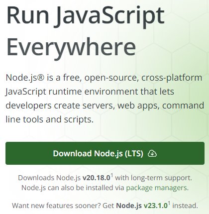

# Next.js 환경 구축하기

## 1. Node.js 설치
[Node.js 홈페이지](https://nodejs.org/en)에서 LTS 버전을 다운로드 한다.
<br><br>

<br><br>
프로젝트는 Node.js **v20.18.0**으로 진행하였다.

## 2. npx create-next-app@latest
[Next.js Getting Started](https://nextjs.org/docs/getting-started/installation)
<br><br>
Next.js를 빠르게 구축할 수 있는 라이브러리가 존재한다. 해당 명령어를 사용하여 빠르게 구축해보자.
```powershell
# 2024-10-25 기준 최신버전 = Next.js v15.0.1
PS C:\Users\user\Desktop\Group-11> npx create-next-app@latest ai_web_front
```

```powershell
# JS에 타입을 강제하여 생산성을 증가시킨 언어
# JavsScript로 진행할 예정이므로 No
√ Would you like to use TypeScript? ... √No / Yes
# JS나 JSX 코드 가독성을 높이고 더 효율적으로 개발할 수 있게 해주는 Lint 라이브러리
# 사용하지 않으므로 No
√ Would you like to use ESLint? ... √No / Yes
# 각 Element의 Class 속성 예약어로 CSS를 빠르게 구현할 수 있게 하는 라이브러리
# Module.CSS를 사용할 것이므로 No
√ Would you like to use Tailwind CSS? ... √No / Yes
# 앱의 핵심 파일들을 기본인 app 디렉토리가 아닌 src 디렉토리로 진행
# 과거 Next.js는 src를 사용하였으므로 남아있는 옵션이다.
# app directory를 사용할 것이므로 No
√ Would you like your code inside a `src/` directory? ... √No / Yes
# App directory 및 최신 Router 타입인 App Router를 사용할 것이므로 yes
√ Would you like to use App Router? (recommended) ... No / √Yes
# Next.js 15 버전부터 추가된 Turbopack 기능이다.
# RUST 언어로 작성되어 next dev 실행 시 더욱 빠른 실행 환경을 제공한다.
# yes
√ Would you like to use Turbopack for next dev? ... No / √Yes
# 다른 파일을 import 할 때 root 폴더를 특정 키워드로 참조할 수 있게 하는 옵션
# 기본 옵션이 `@`이며, 기본 값을 사용할 것이므로 no
√ Would you like to customize the import alias (@/* by default)? ... √No / Yes

Creating a new Next.js app in C:\Users\user\Desktop\Group-11\ai_web_front.

Using npm.

Initializing project with template: app


Installing dependencies:
- react
- react-dom
- next


added 28 packages, and audited 29 packages in 30s

5 packages are looking for funding
  run `npm fund` for details

found 0 vulnerabilities
Success! Created ai-web-front at C:\Users\user\Desktop\Group-11\ai_web_front
```

## 3. Next.js 실행해보기
생성한 폴더로 접근하여 node.js 명령어를 통해 next.js를 실행해보자
```powershell
PS C:\Users\user\Desktop\Group-11\ai_web_front> npm run dev

> ai_web_front@0.1.0 dev
> next dev --turbopack

  ▲ Next.js 15.0.1 (Turbopack)
  - Local:        http://localhost:3000

 ✓ Starting...
 ✓ Ready in 8s
```

이후 `http://localhost:3000`으로 접근하면 아래 페이지가 나타난다.


여기까지 진행했다면 환경설정 완료 ☺️