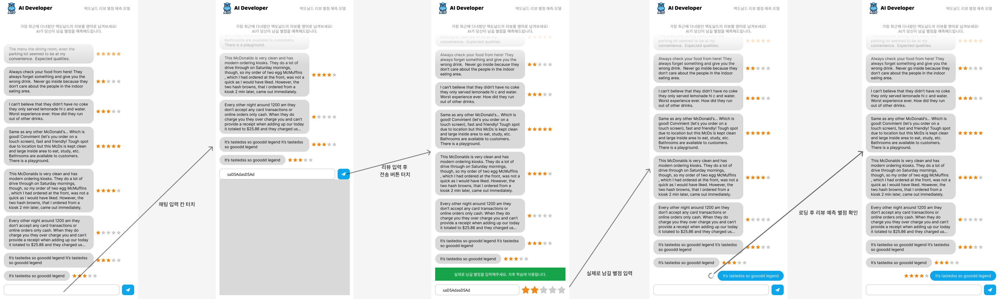

# 들어가며

프론트엔드 (client 단)과 백엔드(서버)와 통신하기 위해 REST API를 이용한다. 기획된 서비스의 작동 순서 및 흐름에 맞게 설계가 되며 어떻게 API를 구성하면 될지 알아보자.

# 필요한 API 뽑아내기

위 와이어프레임을 기준으로 API를 뽑아보자. 와이어 프레임 이미지에는 왼쪽부터 5개의 화면이며 왼쪽에서 오른쪽 방향으로 설명하겠다.

## 1. 초기 화면

**페이지를 처음 접속하면 나타나는 화면**

페이지를 처음 접속하면 이미 다른 사용자들이 테스트해본 리뷰 내역이 채팅형식으로 AI가 예측한 별점과 함께 로드된다. 다른사용자들의 기록은 서버에서 불러와야하므로 해당 기능은 API화 하여야한다.

### API-01 - 리뷰 목록 불러오기 API

## 2. 리뷰 입력 화면

**리뷰를 입력할 화면**

아래에 있는 채팅 입력칸 터치 시 리뷰를 입력할 수 있다. 화면의 반틈정도 키보드가 올라왔으며 채팅이 입력된 모습이다. 현재 화면에는 별도의 API가 필요하지 않다.

## 3. 내 별점 남기기

**내 리뷰에 별점을 남기는 화면 (차후 학습에 활용하기 위함)**

사용자가 입력한 리뷰에 대해 원래 정답 값인 사용자의 별점(차후 학습을 위함)을 남기는 화면이다. 별점을 남기는 순간 사용자의 리뷰에 대해 AI가 별점을 예측하도록 사용자의 리뷰 데이터가 서버로 넘어가야한다.

### API - 02 리뷰 등록 API

## 4. 리뷰 별점 예측 중

**리뷰가 모델로 전달되어 모델의 예측을 기다리는 상태**

사용자의 리뷰가 서버로 넘어가면 서버는 해당 리뷰를 pytorch model로 입력한다. 모델 예측에 약 수초간의 시간이 소요되므로 프론트엔드는 리뷰를 넘긴 후 예측이 완료될 때까지 기다리고, 완료됨을 확인하면 모델이 예측한 별점을 로드하여야한다. 따라서, 예측 상태를 확인하기 위해 아래 API가 필요하다.

### API - 03 리뷰 별점 예측 진행 상태 확인 API

## 5. 예측완료

**모델이 사용자의 리뷰에 대해 별점 예측을 끝낸 상태**

위에서 상술했던 이유로, 완료 확인 후 모델이 예측한 별점을 서버에서 로드하는 API가 필요하다. 따라서 다음 API가 필요하다.

### API - 04 특정 리뷰 예측된 별점 불러오기 API

# 각 API에 대해 명세서 작성하기.

| API 제목 및 역할 | 요청 URL | Method |
|:---:|:---:|:---:|
| [리뷰 등록하기](./post_api_review.md) | `api/review` | `POST` |
| [리뷰 리스트 불러오기](./get_api_review.md) | `api/review` | `GET` |
| [리뷰 예측 상태 확인](./get_check_[id].md) | `api/check/[id]` | `GET` |
| [특정 리뷰 불러오기](./get_review_[id].md) | `api/review/[id]` | `GET` |