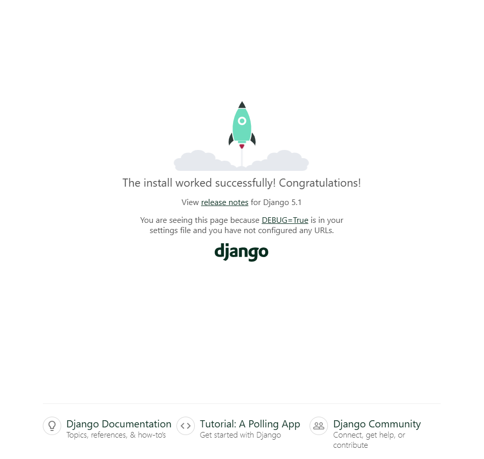

# Django 환경 구축하기

## 0. Python 설치 및 Python 가상환경 구축하기
Django 및 Django-rest-framework, Pytorch 등 수많은 라이브러리가 설치될 예정이므로 Python 가상환경을 이용해 global python과 분리하여 라이브러리간 충돌을 피해보자.

아래 페이지에 접속하여 Python을 설치한다.<br>
Python 3.11.4 버전을 기준으로 작성되었으므로 해당 버전을 권장한다.
#### [Python Install Page](https://www.python.org/downloads/)

Python 가상환경을 구축해보자.

```powershell
…\Group-11> python -m venv .venv
```

`.venv` 대신 다른 폴더 이름을 사용하여도 좋으나 `.venv` 폴더명은 다른 환경 파일과 이름이 겹치지 않고 많은 파이썬 프로젝트들이 해당 폴더명을 사용하므로 편의상 `.venv`를 기준으로 진행할 것 이다.

기다린 후 아래와 같이 `.venv` 폴더가 생겨있을 것이다.
```shell
Root Directory
----
.github
.venv << 파이썬 가상환경 폴더
ai_web_front
...
```

가상환경을 실행해보자.

(Window)
```powershell
…\Group-11> .\.venv\Scripts\activate
```

(Mac OS)
```shell
source .venv/bin/activate
```

가상환경 실행이 완료되면 아래와 같이 표시될 것이다.
```powershell
(.venv) …\Group-11> 
```

## 1. Python Library 설치
해당 프로젝트에 필요한 파이썬 라이브러리는 다음과 같다.

**프로젝트가 진행되면서 필요한 라이브러리가 많아짐 링크 접속 후 내용 복사 추천 →**
[`pip_requirements.txt`](../../ai-web-back/pip_requirements.txt)
```text
asgiref==3.8.1
Django==5.1
djangorestframework==3.15.2
sqlparse==0.5.1
```

위 내용을 Root Directory에 [`pip_requirements.txt`](../../ai-web-back/pip_requirements.txt)로 생성하여 붙여넣자.
```text
📁 ┬ 📁.venv
🔹 ├ 📁ai_web_front
🔹 ├ 📄pip_requirements.txt << This file
```

이후 아래 명령어를 입력하면 필요한 모든 라이브러리가 설치된다.
<br>
가상환경을 활성화 하지 않은 상태로 아래 명령어를 실행하면 라이브러리가 Global로 설치되므로 꼭 가상환경을 활성화하자.

```powershell
(.venv) …\Group-11> pip install -r pip_requirements.txt
```

## 2. Django 앱 생성하기
Root 폴더에 Django 앱이 들어갈 폴더를 만들어준다. 그럼 다음과 같은 폴더 구조가 될 것이다.

```text
📁 ┬ 📁.venv
🔹 ├ 📁ai_web_front
🔹 ├ 📁ai_web_back
🔹 ├ 📄pip_requirements.txt
```

이후 root 폴더에서 아래 명령어를 실행해보자.

```powershell
(.venv) …\Group-11> django-admin startproject app ai-web-back
```

Django 앱이 다음과 같이 생성된다.

```text
📁 ┬ 📁.venv
🔹 ├ 📁ai_web_front
🔹 ├ 📁ai_web_back ┬ 📁app ┬ 🐍__init__.py
🔹 │ 🔹            │ 🔹    ├ 🐍asgi.py
🔹 │ 🔹            │ 🔹    ├ 🐍settings.py
🔹 │ 🔹            │ 🔹    ├ 🐍urls.py
🔹 │ 🔹            │ 🔹    └ 🐍wsgi.py
🔹 │ 🔹            └ 🐍manage.py
🔹 └ 📄pip_requirements.txt
```

## 3. Django 앱 첫 실행해보기
생성한 Backend 폴더에서 Django development 서버를 실행해보자.
```powershell
(.venv) …\Group-11\ai-web-back> python manage.py runserver

Watching for file changes with StatReloader
Performing system checks...

System check identified no issues (0 silenced).

You have 18 unapplied migration(s). Your project may not work properly until you apply the migrations for app(s): admin, auth, contenttypes, sessions.
Run 'python manage.py migrate' to apply them.
October 26, 2024 - 15:10:28
Django version 5.1, using settings 'app.settings'
Starting development server at http://127.0.0.1:8000/
Quit the server with CTRL-BREAK.
```

http://127.0.0.1:8000/ 로 접속하면 아래와 같은 페이지가 실행된다.



## 4. .gitignore 편집하기 (github 사용 시)
Next.js는 [Create-next-app](NextJS_Install_and_Setting.md) 명령어로 생성시 자동으로 .gitignore 파일을 생성해주지만 django는 그렇지 않다. 따라서, 프로젝트 진행시 깃허브에 필요없는 파일이나 로컬마다 다른 파일 내용(db.sqlite3, .venv, __pycache__ 등)이 섞일 수 있으므로 다음 파일들을 `.gitignore`에 등록해주어야한다.

```text
📁 ┬ 📁.venv
🔹 ├ 📁ai_web_front
🔹 ├ 📁ai_web_back
🔹 ├ 📄pip_requirements.txt
🔹 └ ❌.gitignore << here
```

```py
# environment variables
.env

# python virtual environment
.venv

# pycache
*.pyc
__pycache__/

# metadata in macOS
.DS_Store

# sqlite data
db.sqlite3
```

여기까지 진행했다면 환경설정 완료 ☺️