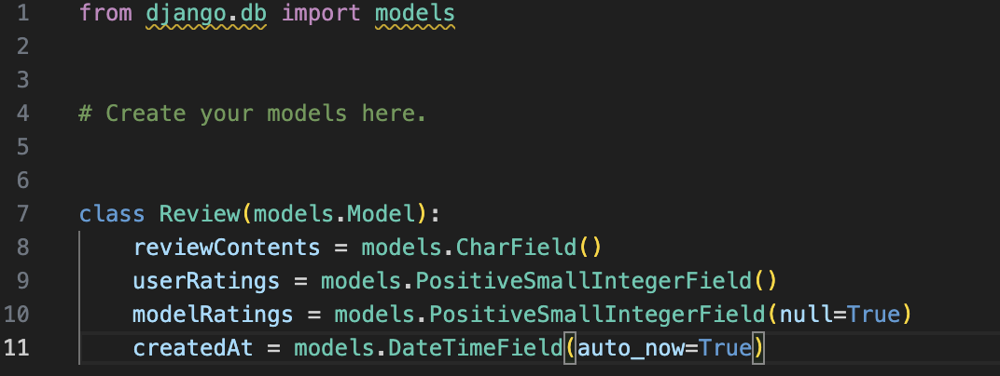
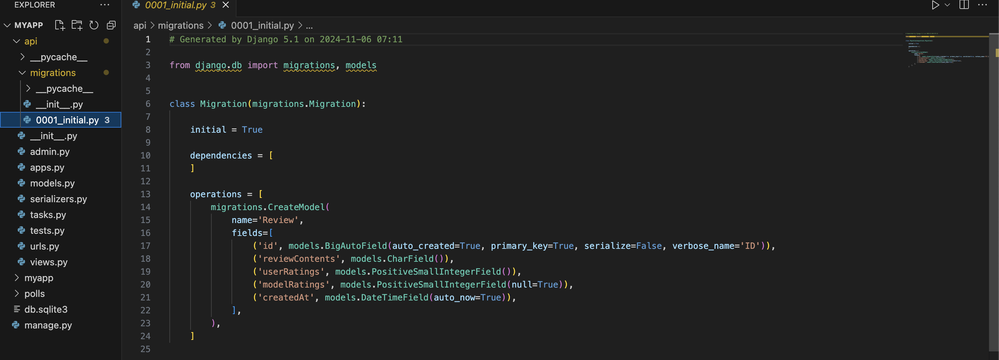
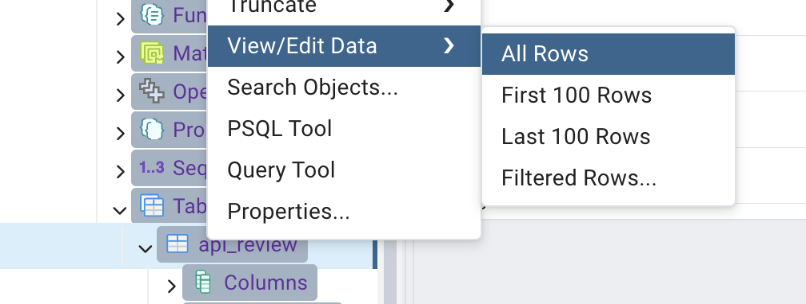
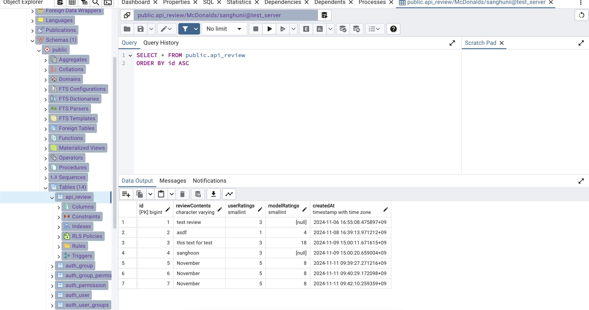

# DatabaseDevelopment

Week4 에서 djagno app과 postgreSQL 데이터 베이스를 연결해 놨다. 

이제 django의 간편한 ORM시스템을 이용해서 간편하게 데이터베이스를 조작할 수 있다.

## 1. django models.py에서 테이블 schema 정의

## 2. `makemigrations`

`python manage.py makemigrations [app-name]` 을 이용해서 migration파일을 Django app내부에 생성 

## 3. `migrate`

`python [manage.py](http://manage.py) migrate [app-name]` 을 이용해서 DB에 반영

그리고 Database를 확인해 보면 

이렇게 models.py에 정의한 table schema대로 table이 정상적으로 생성된 것을 볼 수 있다.
