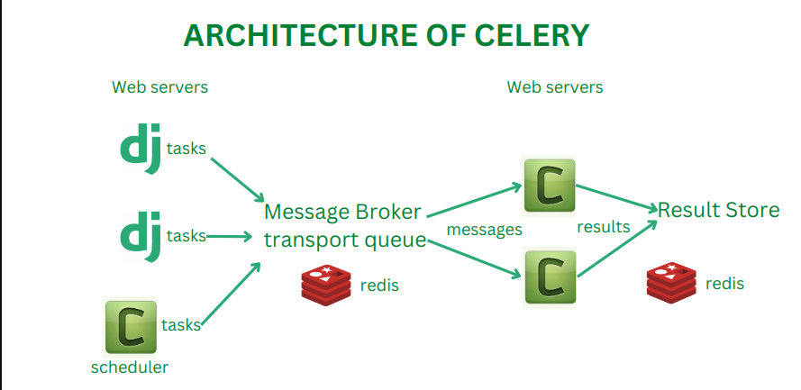
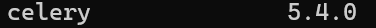
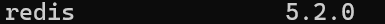
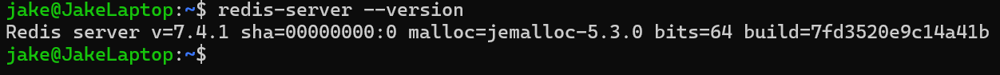
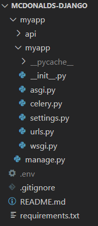
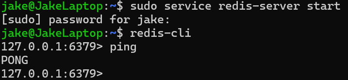
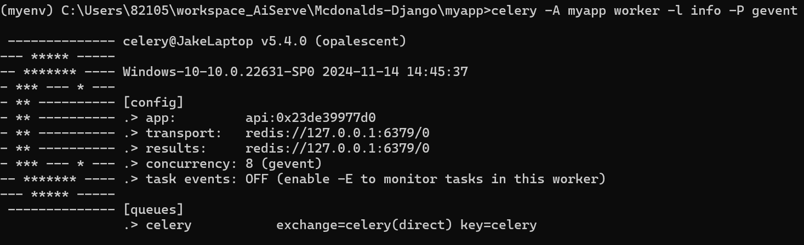

# RESTAPI

## 1. 비동기 처리를 위한 celery및 redis 개념

AI모델의 연산시간이 길어지는 경우를 대비하기 위해 비동기 처리를 구현할 필요가 있다.


Celery는 분산 메시지 전달을 기반으로 동작하는 비동기 작업 큐이다.

Celery는 broker와 worker로 구성된다. 



Broker 는 Message Queue 의 역할을 하게 되고 Worker 가 일정 간격마다 Polling을 하면서 Message Queue에 있는 Task들을 가져가서 실행하게 되는 방식이다.


redis는 Broker의 한 종류이다.


## 2. celery 설치 (redis 디펜던시 포함)

프로젝트 가상환경에서 해당 명령어를 실행하면 redis를 사용하기 위한 의존성도 한번에 설치할 수 있다.

```powershell
> pip install 'celery[redis]'
```

해당 명령어를 작성하고 다음 명령어를 실행하면 celery와 redis 사용을 위한 라이브러리가 잘 설치되었음을 확인할 수 있다.

```powershell
> pip list
```






## 3. redis(WSL2)

윈도우 개발환경에서는 redis 설치가 쉽지 않아 WSL2를 설치한 후 WSL2에서 redis 설치를 진행하였다.

우분투 환경에서 다음 명령어들을 순차적으로 실행하면 redis를 설치할 수 있다.

```powershell
$ sudo apt-get update
$ sudo apt-get upgrade
$ sudo apt-get install redis-server
$ redis-server --version
```
다음 화면이 나타나면 redis가 잘 설치되었음을 의미한다.



## 4. 비동기 처리를 위한 장고 설정

셀러리 사용을 위해서는 추가적인 설정이 필요하다.



먼저 \_\_init__ 파일에는 다음과 같은 코드를 추가해주어야 한다.

```powershell
#myapp/myapp/__init__.py
from .celery import app as celery_app

__all__ = ['celery_app']
```
그리고 celery 파일을 만들어 다음 코드를 추가해준다.

```powershell
#myapp/myapp/celery.py
import os

from celery import Celery
from django.conf import settings

#프로젝트 이름 설정 주의
os.environ.setdefault('DJANGO_SETTINGS_MODULE', 'myapp.settings')
app = Celery('api')

app.config_from_object('django.conf:settings', namespace='CELERY')

app.autodiscover_tasks(lambda: settings.INSTALLED_APPS)

@app.task(bind=True)
def debug_task(self):
    print("Request: {0!r}".format(self.request))
```

위 코드를 사용할때에는 프로젝트 이름을 알맞게 설정해야함을 주의하여야 한다.

다음으로 settings에 다음 코드를 추가한다.

```powershell
#myapp/myapp/settings.py
CELERY_BROKER_URL = os.environ.get('CELERY_BROKER_URL')
CELERY_RESULT_BACKEND = os.environ.get('CELERY_RESULT_BACKEND')

CELERY_ALWAYS_EAGER = True
CELERY_BROKER_URL = CELERY_BROKER_URL
CELERY_RESULT_BACKEND = CELERY_RESULT_BACKEND
CELERY_ACCEPT_CONTENT = ['application/json']
CELERY_RESULT_SERIALIZER = 'json'
CELERY_TASK_SERIALIZER = 'json'
CELERY_TIMEZONE = 'Asia/Seoul'
```

위 코드에서 환경 변수값들은 숨겨져 있지만 로컬 환경에서는 

CELERY_BROKER_URL과 CELERY_RESULT_BACKEND 모두 "redis://127.0.0.1:6379/0" 주소를 사용하면 된다.

마지막으로 celery를 사용하는 앱 안에서 tasks파일을 만들어 비동기 처리를 수행할 함수를 만들면 된다.

```powershell
#myapp/api/tasks.py
from myapp.celery import app

@app.task()
def function():
  todo
```

## 5.celery 서버 구동

윈도우 환경에서는 celery worker가 작동하지 않을 경우 gevent 라이브러리를 다운받은 후 진행하는 것을 권장한다.

다음 명령어로 gevent 라이브러리를 설치할 수 있다.

```powershell
> pip install gevent
```


celery를 실행하기 전에 redis 서버를 먼저 구동한다.

다음은 우분투 환경에서의 redis 서버 명령어이다.

```powershell
$ sudo service redis-server start
$ sudo redis-cli
```

위의 두 명령어를 차례대로 실행한 후에 ping을 입력하면 pong이 출력된다. 

다음과 같은 화면이 출력되면 redis 서버가 구동된 상태이다.



그 다음으로 다음 명령어를 통해서 celery를 구동하면 된다.

명령어를 실행하기 전에 해당 프로젝트로 디렉토리를 이동해야 한다.

다음은 celery 서버 구동을 위한 윈도우 명령어이다.

```powershell
...\myapp> celery -A myapp worker -l info -P gevent
```

Mac과 Linux는 다음과 같다.
```shell
celery -A myapp worker -l info --pool threads 
```



다음과 같은 화면이 나타나면 비동기처리 구현을 위한 모든 준비가 마쳐진 상태이다.
