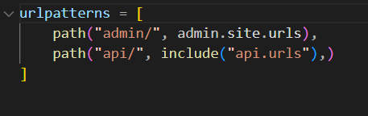
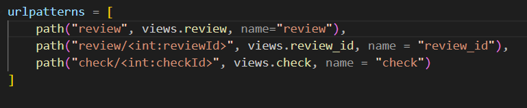
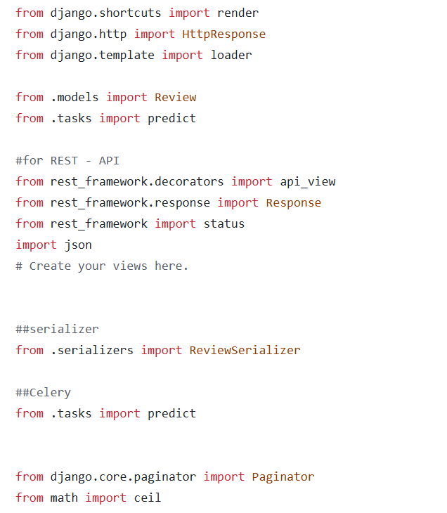

# RESTAPI

## 1. RESTAPI 구현을 위한 url 설정

API 명세서에 작성된 url 경로에 따라 view를 호출하기 위해 다음과 같이 urls 파일을 수정하였다.

myapp/urls.py



해당 코드는 최초 url에서 도메인 주소를 지운 후 api/와 매핑여부를 파악한다.

매핑이 된다면 url에서 api/를 제거한 후 나머지 url을 myapp/api/urls로 전송한다.



이후에는 나머지 url을 통해 view의 함수를 매핑한다.

<int:파라미터 이름>은 url 파라미터를 의미한다. 해당 파라미터에 의해 view가 반환하는 데이터가 달라진다.

다음은 RESTAPI 구현을 위한 라이브러리들이다.



비동기 처리 구현을 위해 tasks를 import해야함에 주목하자.


## 2. api/review

다음은 리뷰 리스트를 불러오거나 리뷰를 저장하는 api이다.

RESTAPI 특성으로 인해 데코레이터를 사용하여 POST도 하나의 함수 안에 같이 구현하였다.

```powershell
@api_view(["POST" ,"GET"])
def review(request):
    if request.method == "POST":
        reviewContents = request.data['reviewContents']
        userRatings = request.data['userRatings']
        R = Review.objects.create(reviewContents = reviewContents, userRatings=userRatings)
        review_id = R.id
        predict.delay(reviewContents, review_id)
        return Response({'id':review_id}, status=status.HTTP_201_CREATED)


    elif request.method == "GET":
        allReviews = Review.objects.order_by('id')
        page = int(request.query_params.get('page',1))          
        paginator = Paginator(allReviews, request.query_params.get('size'))          
        reviews = paginator.get_page(page)          
        maxPage = max(paginator.page_range)
        result = {'reviews': [{"id": review.id, 
                               "reviewContents":review.reviewContents, 
                               "modelRatings":review.modelRatings} for review in reviews],
                    'pageinfo': maxPage}
        return Response(result, status=status.HTTP_200_OK )
```


### 2-1. api/review(POST)

다음 코드는 리뷰데이터 저장 및 모델 예측에 사용된다.

```powershell
    if request.method == "POST":
        reviewContents = request.data['reviewContents']
        userRatings = request.data['userRatings']
        R = Review.objects.create(reviewContents = reviewContents, userRatings=userRatings)
        review_id = R.id
        predict.delay(reviewContents, review_id)
        return Response({'id':review_id}, status=status.HTTP_201_CREATED)
```

request 데이터를 통해 모델을 만들고 모델의 id를 변수에 저장한다.

빠른 HTTP응답을 위해 모델이 예측하는 predict 함수는 비동기처리를 진행하고 response를 프론트엔드에 전송한다.

-----

다음은 비동기처리 함수이다.

predict.delay(reviewContents, review_id)가 실행되면 celery를 통해 동작한다.

아직 예측모델을 병합하지 않아 긴 시간소요를 시뮬레이션 하기 위해 10초동안 동작을 정지하는 함수를 사용했다.

```powershell
@app.task()
def predict(string:str, review_id:int) -> None:
    modelRatings = len(string)
    time.sleep(10)
    review = Review.objects.get(id = review_id)
    review.modelRatings = modelRatings
    review.save(update_fields=['modelRatings'])
```

리뷰 id와 텍스트를 모델에 전달하여 모델의 별점 예측이 완료되었을 때 데이터베이스에 null값으로 저장된 modelRatings를 업데이트한다.

-----

### 2-2. api/review(GET)

다음 코드는 페이지네이션에 사용된다.

```powershell
elif request.method == "GET":
        allReviews = Review.objects.order_by('id')
        page = int(request.query_params.get('page',1))          
        paginator = Paginator(allReviews, request.query_params.get('size'))          
        reviews = paginator.get_page(page)          
        maxPage = max(paginator.page_range)
        result = {'reviews': [{"id": review.id, 
                               "reviewContents":review.reviewContents, 
                               "modelRatings":review.modelRatings} for review in reviews],
                    'pageinfo': maxPage}
        return Response(result, status=status.HTTP_200_OK )
```

데이터베이스에서 정보를 불러오는 api이다. Query 파라미터를 통해 가져올 데이터의 위치와 수를 지정한다.

필요한 데이터만 불러오기 위해 paginator를 사용하였다.

처음에는 데이터 전체를 불러와 슬라이싱하는 방법을 선택했지만 병목현상이 우려되어 paginator를 채택하게 되었다.


## 3. api/review[id]

다음 코드는 비동기처리로 진행된 리뷰의 모델 예측이 완료된 후의 정보를 전달한다.

```powershell
def review_id(request, reviewId):
    if request.method == "GET":
        review = Review.objects.filter(id = reviewId)
        if (review) :
            review = review = Review.objects.get(id = reviewId)
            result = {"id": review.id, "reviewContents": review.reviewContents, "modelRatings":review.modelRatings}
            return Response(result, status = status.HTTP_200_OK)
        else :
            result = {
	                "message": "등록되지 않은 메세지 id입니다"
                    }
            return  Response(result, status = status.HTTP_204_NO_CONTENT)
```

filter 메소드를 통해여 해당 아이디를 가진 행의 정보를 가져와 전송한다.


## 4. api/check[id]

다음 코드는 모델 예측이 끝났는지 여부를 파악한다.

```powershell
@api_view(["GET"])
def check(request, checkId):
    if request.method == "GET":
        review = Review.objects.filter(id = checkId)
        if (review):
            review = Review.objects.get(id = checkId)
            if (review.modelRatings) :
                result = {"status":True}
                return Response(result, status = status.HTTP_200_OK)
                
            else :
                result = {"status":False}
                return  Response(result, status = status.HTTP_200_OK)
        else :
            result = {
	                "message": "등록되지 않은 메세지 id입니다"
                    }
            return  Response(result, status = status.HTTP_204_NO_CONTENT)
```
if (review.modelRatings) 부분에서 modelRatings가 null인지 모델을 통해 예측된 숫자인지 확인할 수 있다.

만약 null값이라면 모델의 예측이 끝나지 않은 상태임을 이용한다.
